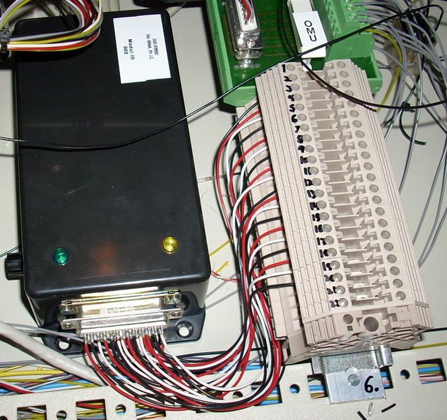

## Source code for project: [Serial port IO module with 9 in and outputs](https://link.stdout.no/n)

Serial port interface with 9 digital inputs and outputs, uses an AVR ATmega8 microcontroller.

Written in basic, using [Bascom-AVR](http://www.mcselec.com/).

### Author
[Thomas Jensen](https://thomas.stdout.no)
